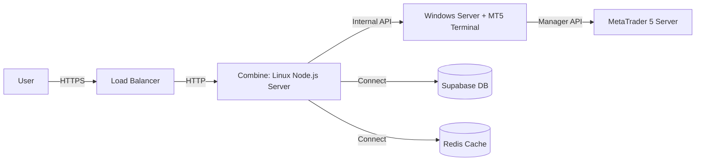

# AWS Infrastructure Recommendations

Based on your requirement to support **7,000 - 10,000 users** and the **Hybrid Architecture** (Node.js + MT5 Python), here is the recommended setup.

## 1. Architecture Overview

You need **two separate servers** because the MT5 Python library is compatible **only with Windows**, while Node.js runs best on **Linux**.

---

## Server 1: The Backend (Node.js)
This server hosts your API, Cron Jobs (Risk Scheduler), and WebSocket Server.

*   **Operating System (AMI)**: `Ubuntu Server 22.04 LTS (HVM), SSD Volume Type`
    *   *Why?* Industry standard, stable, huge community support, works perfectly with Node.js 20.
    *   *Architecture*: 64-bit (x86).
*   **Instance Type**:
    *   **Starting**: `t3.medium` (2 vCPU, 4GB RAM) - Good for dev/testing.
    *   **Production (7k-10k users)**: `c5.xlarge` (4 vCPU, 8GB RAM) or `c6a.xlarge`.
        *   *Why?* API traffic is CPU intensive. The `c5` family is "Compute Optimized".
*   **Disk**: 50GB gp3 SSD (Logs can grow large).

## Server 2: The Bridge (Windows + MT5)
This server runs the `mt5_bridge` Python script and the actual MetaTrader 5 Terminal.

*   **Operating System (AMI)**: `Microsoft Windows Server 2022 Base`
    *   *Why?* Latest stable Windows Server. lighter than "Desktop Experience" versions but you **DO need Desktop Experience** to install the MT5 Terminal GUI.
    *   *Correction*: Choose **"Microsoft Windows Server 2022 with Desktop Experience"**. You need the GUI to log in to the MT5 Terminal.
*   **Instance Type**:
    *   **Starting**: `t3.large` (2 vCPU, 8GB RAM).
    *   **Production**: `m5.large` (2 vCPU, 8GB RAM) or `m5.xlarge` (4 vCPU, 16GB RAM).
        *   *Why?* Windows Server itself needs ~2-4GB RAM. MT5 Terminal needs RAM. The `m5` family is "General Purpose/Memory Balanced".
*   **Disk**: 60-80GB gp3 SSD (Windows updates + MT5 logs take space).

---

## 3. Networking & Security

1.  **VPC**: Put both servers in the **same VPC** (Virtual Private Cloud).
2.  **Security Groups**:
    *   **Linux Server Group**:
        *   Inbound: Port 80/443 (Web), Port 22 (SSH - specific IP only).
    *   **Windows Server Group**:
        *   Inbound: Port 3389 (RDP - specific IP only).
        *   Inbound: **Port 8000** (Bridge API) - **Restrict Source to Linux Server's Private IP only**.
        *   *Crucial*: Do NOT open Port 8000 to the public internet. Only the Linux Backend should talk to it.

## 4. Cost Estimation (Approximate)

*   **Linux (c5.xlarge)**: ~$124/month
*   **Windows (m5.large)**: ~$136/month (includes Windows license cost)
*   *Total*: ~$260/month (excluding bandwidth/storage).

> **💡 Cost Saving Tip**: Use **Savings Plans** or **Reserved Instances** for 1-year terms to save ~30-40%.

## 5. Summary Checklist

| Server | Role | AMI Selection | Instance Size |
| :--- | :--- | :--- | :--- |
| **Linux** | Node.js API | **Ubuntu Server 22.04 LTS** | `c5.xlarge` (Prod) |
| **Windows** | MT5 Bridge | **Windows Server 2022 with Desktop Experience** | `m5.large` (Prod) |
