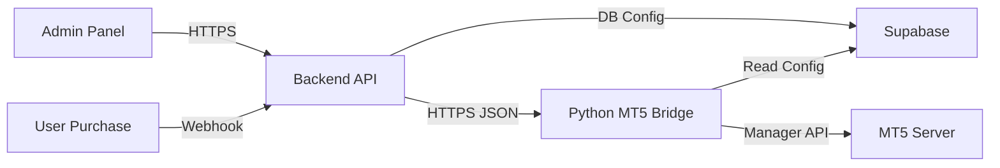

# MT5 System Architecture & Master Protocol

This document serves as the **Single Source of Truth** for the entire MT5 Integration System. It defines the architecture, API protocols, data flows, and implementation details for **Account Creation**, **Risk Management**, and **Admin Control**.

---

## 1. System Overview

**Components:**
1.  **Frontend (Next.js)**: User Dashboard (User Portal) & Admin Panel (Control Center).
2.  **Backend (Next.js API)**: Handles Webhooks, Business Logic, and Database interactions.
3.  **Database (Supabase)**: Stores User Data, Risk Rules (`mt5_risk_groups`), Logs (`system_logs`), and Bridge Config (`mt5_server_config`).
4.  **MT5 Bridge (Python FastAPI)**: The critical link that speaks to the MetaTrader 5 Manager API.

**Architecture Diagram:**


---

## 2. Core Workflows (The "How It Works")

### A. Account Creation (The "Purchase" Flow)
**Trigger**: Payment Webhook (`/api/webhooks/payment`) or Admin Manual Create.
**Flow**:
1.  **Backend** validates payment/request.
2.  **Backend** determines `Group` and `Initial Balance`.
3.  **Backend** calls Bridge: `POST /create-account`.
4.  **Bridge**:
    - Generates Password.
    - Calls `Manager->UserCreate`.
    - **Crucial**: Calls `Manager->DealerBalance` to deposit `Initial Balance` (Comment: "Initial Deposit").
5.  **Bridge** returns Login credentials.
6.  **Backend** saves credentials to `challenges` table.

### B. Risk Monitoring (The "Scheduler" Flow)
**Trigger**: Every 20 seconds via `risk-scheduler.ts`.
**Flow**:
1.  **Scheduler** fetches active `challenges` from DB.
2.  **Scheduler** fetches rules (`mt5_risk_groups`).
3.  **Scheduler** calculates `MinEquityLimit` (Drawdown threshold).
4.  **Scheduler** calls Bridge: `POST /check-bulk` with `[ { login: 123, min_equity: 45000 } ]`.
5.  **Bridge**:
    - Fetches live `Equity` from MT5.
    - Checks `Equity <= min_equity`.
    - If **Breached**:
        - Closes all Open Positions (`TA_DEALER_CLOSE`).
        - Deletes Pending Orders.
        - Disables Account (`UserUpdate`).
        - Returns `status: "FAILED"`.
6.  **Scheduler** marks account as `breached` in DB if Failed.

### C. Trade Sync (The "Dashboard" Flow)
**Trigger**: User views Dashboard (`/api/mt5/fetch-trades`).
**Flow**:
1.  **Backend** calls Bridge: `POST /fetch-trades`.
2.  **Bridge** fetches History (`DealerGetDeals`) and Open Positions (`DealerGetPositions`).
3.  **Bridge** merges Deals into "Trades" (Entry + Exit).
4.  **Frontend** displays history.

---

## 3. MT5 Bridge API Specification (Python)

**Base URL**: `http://localhost:5001`

### 1. Create Account
**Endpoint**: `POST /create-account`
**Payload**:
```json
{
  "name": "Trader Name",
  "email": "user@example.com",
  "group": "demo\\risk_test",
  "leverage": 100,
  "balance": 50000
}
```
**Response**: `{ "login": 12345, "password": "...", "group": "..." }`

### 2. Check Bulk (Risk Engine)
**Endpoint**: `POST /check-bulk`
**Payload**:
```json
[
  { "login": 12345, "min_equity_limit": 46000.0, "disable_account": true, "close_positions": true }
]
```
**Response**:
```json
[
  { "login": 12345, "status": "SAFE", "equity": 50100.0, "balance": 50000.0 },
  { "login": 67890, "status": "FAILED", "equity": 45000.0, "actions": ["closed_positions"] }
]
```

### 3. Manual Actions (Admin Control)
- **Disable**: `POST /disable-account`, Body: `{ "login": 12345 }`
- **Stop Out**: `POST /stop-out-account`, Body: `{ "login": 12345 }`
- **Deposit**: `POST /deposit`, Body: `{ "login": 12345, "amount": 1000, "comment": "Bonus" }`

### 4. System Control (Dynamic Config)
**Endpoint**: `POST /reload-config`
**Description**: Forces the bridge to reload connection details (IP, Login, Pass) from Supabase and reconnect.
**Payload**: `{}` (Empty)

---

## 4. AI Prompt for Developers

Copy this prompt to instruct an AI to work on this system:

> **Role**: Senior System Architect & MT5 Developer
>
> **Context**: You are working on the "SharkFunded" Prop Firm Infrastructure.
>
> **Architecture**:
> - **Frontend/Backend**: Next.js 14 (App Router) + Supabase.
> - **Bridge**: Python FastAPI app (`mt5_bridge/main.py`) using `mt5_worker.py` wrapper for `Clr` (Python.NET) Manager API.
>
> **Key Protocols**:
> 1. **Configuration**: The Bridge loads config from `mt5_server_config` table in Supabase. Use `POST /reload-config` to refresh.
> 2. **Risk**: The "Risk Scheduler" (TypeScript) is the brains; the Bridge is the muscle. The Bridge executes "Stop Out" only when told by the Scheduler.
> 3. **Account Integrity**: Every Create Account MUST be followed by a `DealerBalance` deposit call.
>
> **Your Task**: [Insert Task Here, e.g., "Implement a new feature to change Leverage dynamically"]
>
> **Constraint**: Always check `MT5_BRIDGE_API_GUIDE.md` for existing endpoints before creating new ones.

